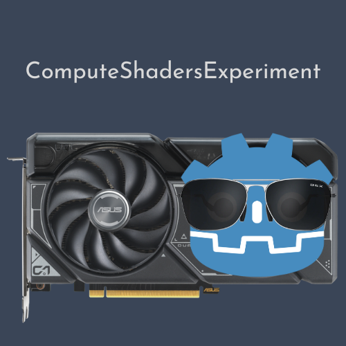

# ComputeShadersExperiment

<div align="center">
	
</div>

Welcome to ComputeShadersExperiment, a Godot project dedicated to exploring the capabilities of compute shaders!

_PS: While there isn't a video showcasing the project due to performance issues during recording, the images below provide a glimpse of what the project accomplishes._

## Images 🎥
<div align="center"><b>Uses Compute Shader</b></div>


<div align="center"><b>Does Not Use Compute Shader</b></div>


## Download 📥
You can either download the repo or clone it:

```bash
git clone https://github.com/yunusey/ComputeShadersExperiment.git
cd MultiplayerExperiment
```

Once downloaded, import it into the Godot editor to get started!

## What is it? 🤔
ComputeShadersExperiment simulates a solar system (as depicted in the images). It's based on [Newton's law of universal gravitation](https://en.wikipedia.org/wiki/Newton's_law_of_universal_gravitation), where each particle in the universe attracts every other particle with a force proportional to their masses and inversely proportional to the square of the distance between them. Implementing this system requires calculating interactions between multiple planets and the sun. As the number of planets (N) increases, the complexity rises with O(N^2) iterations needed for calculations. While CPU-based computations face limitations due to concurrent processing, GPU execution (simultaneous processing) offers an advantage, which we explore through this project. Resources like **NekotoArts**'s [Raytracing in Godot 4](https://github.com/nekotogd/Raytracing_Godot4/) and [video on compute shaders in Godot](https://www.youtube.com/watch?v=ueUMr92GQJc) are great for delving deeper into compute shaders in Godot.

## Directions
When you launch the animation, it starts in a paused state. To initiate playback, simply press the `Space` key. You can move the Sun using `WASD` keys. For a comparative analysis between using compute shaders and not utilizing them, you can click on the `Use Compute Shader` button to toggle this feature. If you prefer to disable the interaction between planets (which creates a very beautiful pattern), you can achieve this by toggling the `Planet Interaction` button. These settings can be adjusted at any time during the animation, and the changes will take effect immediately. If you want to change the number of initial planets and the number of spawning planets every second, you need to change it from the editor under [Main Scene](./Main.gd)'s `Animation Settings` and `Animation Parameters`. The settings you can change there are:

- Initial Planets (1000 by default)
- Planets per Timeout (1 by default)
- Max Planets (2000 by default)
- Rotation Speed (1.0 by default)

## License 📃
This project is licensed under the MIT License, granting you the freedom to use and distribute it for any purpose.

## Contributing 🤝
All forms of contributions are highly appreciated! Given my limited experience with compute shaders, there may be areas in the project that require improvement. Your insights and expertise would be invaluable.

## Final Words 💬
Thank you for exploring ComputeShadersExperiment! If you find this project intriguing or useful, consider leaving a ⭐️ to show your support. Your feedback is invaluable, encouraging further development and inspiring others to engage with this project.
